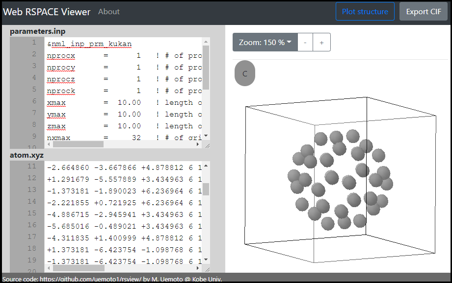

# Web RSPACE Viewer

A interactive viewer for RSPACE program

This program is a utility to visualize input files of RSPACE, a first-principles density functional theory (DFT) program for solid and molecule systems.

This program has functionalities as below:
- 3D visualization of atomic structure.
- Export CIF file from RSPACE input file.

## External Links

### RSPACE
- K. Hirose, T. Ono, Y. Fujimoto and S. Tsukamoto "First-Principles Calculations in Real-Space Formalism: Electronic Configurations and Transport Properties of Nanostructures", Imperial College Press (2005) [doi: 10.1142/P370](https://doi.org/10.1142/p370)
- Official Website - http://www2.kobe-u.ac.jp/~tomoono/rspace.html

### Ono group, Kobe university
- http://www2.kobe-u.ac.jp/~tomoono/index.html
  

  
